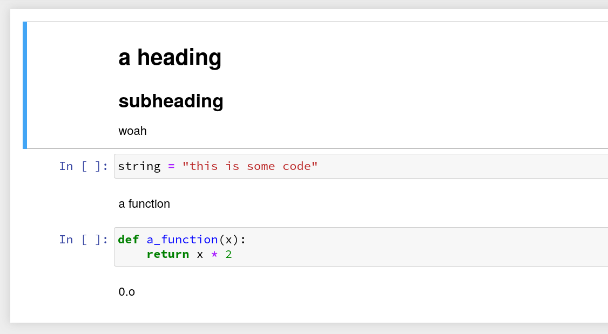

# zeus
converts between commented python and ipynb

## Python
```py
# # a heading
# ## subheading
#
# woah

string = "this is some code"

# a function

def a_function(x):
    return x * 2

# 0.o
```

Gets converted to:


